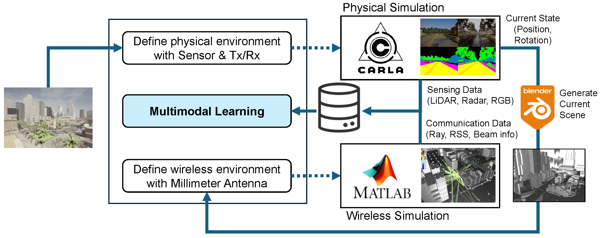
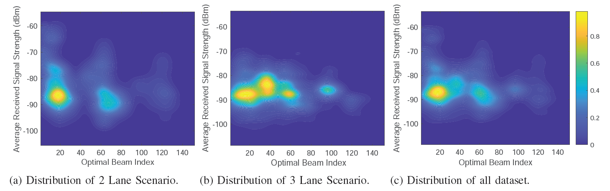

# Multimodal Realistic Simulation Framework for Sensing-Aided Communication 

This repository provides the code for a **multimodal realistic simulation framework** using **CARLA** and **MATLAB**. CARLA is used to generate realistic **autonomous driving sensor data**, while MATLAB is employed for **wireless communication simulations**. This framework enables **multimodal sensing data collection**, **3D digital reconstruction**, and **ray-tracing-based wireless channel modeling** to facilitate **beamforming and channel analysis**.  

---

## **🛠️ Workflow Overview**  


### **1️⃣ Environment Setup**  
- **Simulated urban scenarios** with multiple vehicles and base stations in CARLA.  
- Vehicles navigate autonomously, following road layouts and traffic signals.  
- Generates **realistic mobility patterns** and **dynamic sensing conditions** for beamforming and channel evaluation.  

### **2️⃣ Multimodal Sensing Data Generation**  
- At the base station, multiple sensors are deployed to collect multimodal data:  
  - **LiDAR**: Captures 3D point cloud data.  
  - **Radar**: Detects moving objects and their velocities.  
  - **RGB Cameras**: Provides visual scene understanding.  
- CARLA’s API is used to **synchronize sensor data** with vehicle movements and environmental factors.  

### **3️⃣ 3D Digital Reconstruction for Communication Simulation**  
- The **CARLA environment is imported into MATLAB** for wireless communication simulation.  
- Since CARLA and MATLAB use different map formats, we employ the **Blender API** for format conversion.  
- This ensures **geometric consistency** between the simulation environments, maintaining accuracy in wireless modeling.  

### **4️⃣ Wireless Channel Simulation with Ray Tracing**  
- The reconstructed 3D environment is used for **ray-tracing-based wireless channel simulations**.  
- **Beamforming impact on RSS (Received Signal Strength)** is analyzed by tracing signal paths and reflections.  
- Enables **precise evaluation of beam selection strategies** in complex urban environments.  

#### **📌 Key Features**  
✅ **Realistic multimodal sensing**: LiDAR, Radar, RGB Cameras integrated into an urban driving environment.  
✅ **Seamless 3D environment conversion**: CARLA to MATLAB using Blender API.  
✅ **Accurate wireless channel modeling**: Ray tracing for beamforming evaluation.  

---

## **📌 Requirements**  

- **OS**: Windows 10 / Linux (Ubuntu 18.04)  
- **CARLA Simulator**: Version **0.9.15** [(Download)](https://github.com/carla-simulator/carla/releases)
- **MATLAB**: Version **R2024a** [(Download)](https://www.mathworks.com/products/new_products/release2024a.html)
- **Python**: **3.9.21**  
- **Blender**: **4.2** [(Download)](https://www.blender.org/download/releases/4-2/)

---

## **📥 Installation**  

Clone the repository and install the required packages:  
```bash
git clone https://github.com/news-vt/Multimodal-Realistic-Simulation-Framework-for-Sensing-aided-Communication.git
cd your-repo
python -m pip install -r requirements.txt
```
You can verify that the installation was successful by running:  
```bash
python -c "import carla; print('CARLA successfully imported')"
```

---

## **🚀 Getting Started**

#### Using MATLAB Engine API (if MATLAB is Installed)
To use the MATLAB Engine API, you must first install the MATLAB for Python.
**Setup**
If MATLAB is installed, the best way to run `.m` files from Python is through the `matlab.engine` module.

```sh
cd "C:\your-root\MATLAB\R2023b\extern\engines\python"
python -m pip install .
```

#### Using Blender API (if Blender is Installed)
To use the Blender API, you must first install the Blender Engine for Python.
**Setup**
If Blender is installed, you need to setup Blender API for Python.

```sh
cd "D:\your-root\Blender Foundation\Blender 4.2\4.2\python\bin"
python.exe -m pip install --upgrade pip
python.exe -m pip install bpy
python.exe -m pip install pandas
python.exe -m pip install scipy
```

#### Running CARLA
First, launch the installed CARLA executable before proceeding with the simulation.

#### Environment Initialization
In this step, we initialize the environment by **spawning vehicles, adjusting weather conditions, and setting up the scene**.  
You can initialize the environment using the following command:  

```bash
python start_carla.py --host 127.0.0.1 --port 2000 -n 30 --wKind 0
```
📌 **Command Line Arguments:**  
- **`--host`**: IP of the host server (default: `127.0.0.1`).  
- **`--port`**: TCP port to listen to (default: `2000`).  
- **`-n`**: Number of vehicles (default: `50`).  
- **`--wKind`**: Weather condition:  
  - `0`: Sunny  
  - `1`: Night  
  - `2`: Fog  
  - `3`: Rainy  
- **`--matlab`**: Generate sensing data and MATLAB network data simultaneously (but this may take a long time) (default: `False`).  

🔹 **Important:** Keep the console running. In the next step, you will execute the sensing data generation script in a separate console.

---

#### Generating Sensing Data in CARLA 
In this step, CARLA will generate **camera, LiDAR, radar, and vehicle information** as sensing data.  
Run the following command to generate sensing data:  

```bash
python generate_data.py --host 127.0.0.1 --port 2000
```
📌 **Command Line Arguments:**  
- **`--host`**: IP of the host server (default: `127.0.0.1`)
- **`--port`**: TCP port to listen to (default: `2000`)
- **`--matlab`**: Generate sensing data and MATLAB network data simultaneously **(but this may take a long time)** (default: `False`)

🔹 **Warning:** `--matlab` is set to False. It is more efficient for you to run `netdata_alone.py` separately.

🔹 **Configuration:**  
The sensing data parameters, such as **base station location, maximum simulation steps, and data storage paths**, can be modified in `config.py`:  

```python
class GlobalConfig:
    MAX_STEP = 200  # Maximum steps per episode
    SAVE_ROOT = './out/'  # Root directory for saving data
    EPI_NAME = '/episode_x'  # Episode naming format
    MAT_SAVE_ROOT = '../out/'  # MATLAB save directory
    BLENDER_PATH = 'C:/your-root/Blender Foundation/Blender 4.2/4.2/python/bin/python.exe'  # Path to Blender executable

    # Map boundaries
    MAP_X = [-90, 115]
    MAP_Y = [0, 120]

    # Base station location and orientation
    bs_location = [26.252628, -86.328842, 21.305660]
    bs_rotation = [-40, 90, 0]
```


---

## **📊 Dataset**  

The dataset generated using this framework is available on **Kaggle**:  
🔗 [Multimodal Sensing Dataset for Beam Prediction](https://www.kaggle.com/datasets/news-vt/multimodal-sensing-dataset-for-beam-prediction)  

---

## **👥 Authors**
- [Yumin Park](https://github.com/whateveruwant) [](https://github.com/whateveruwant)
- [Walid Saad](https://github.com/saadwalid) [](https://github.com/saadwalid)
- [Choong Seon Hong](https://github.com/choongseon) [](https://github.com/choongseon)

---

## **📝 Citation**
```bibtex
@misc{park2025resourceefficientbeampredictionmmwave,
      title={Resource-Efficient Beam Prediction in mmWave Communications with Multimodal Realistic Simulation Framework}, 
      author={Yu Min Park and Yan Kyaw Tun and Walid Saad and Choong Seon Hong},
      year={2025},
      eprint={2504.05187},
      archivePrefix={arXiv},
      primaryClass={cs.NI},
      url={https://arxiv.org/abs/2504.05187}, 
}
```

---

## **📚 References**
[1] T. M. Inc., “Matlab version: 9.13.0 (r2022b),” Natick, Massachusetts, United States, 2022. [Online]. Available: https://www.mathworks.com

[2] A. Dosovitskiy, G. Ros, F. Codevilla, A. Lopez, and V. Koltun, “CARLA: An open urban driving simulator,” in Proceedings of the 1st Annual Conference on Robot Learning, 2017, pp. 1–16.

[3] Community BO. “Blender - a 3D modelling and rendering package,” Stichting Blender Foundation, Amsterdam; 2018. [Online]. Available from: http://www.blender.org

---